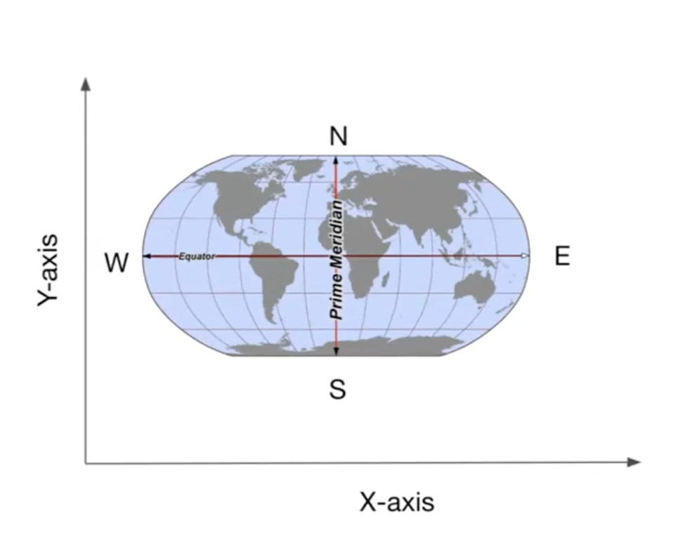
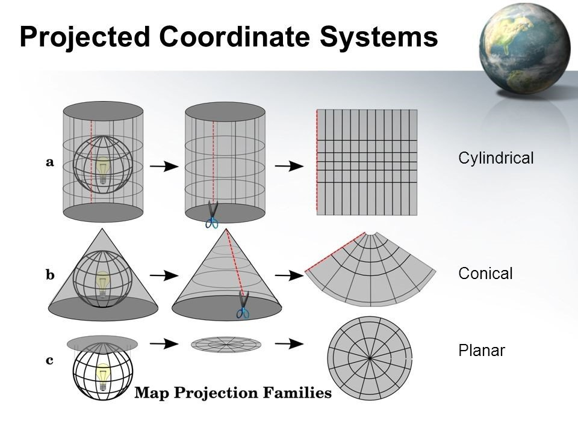

## Modeling Earth's Surface

Gis deals with mapping and analyzing phenomena that is happening on th Earth Surface. Therefore, we need to have an accurate Mathematical representation of of the Earth's Surface to be to analyze this data in a computer system.

## HOW TO MODEL THE EARTH SURFACE

1. `Ellipsoid` : The Earth closely resembles ellipsiod which means that it's a little bit flatter at the *Poles* than at the *Equator*
- The true shape of the Earth is closer to an Ellipsoid
- Defined by semi-major and semi-minor axis
- Semi-major Axis ~ 6378.137 km
- Semi-minor Axis ~ 6356.752 km

2. `Geoid`: Earth shape is  not perfertly smooth ellipsoid. It has undulations resulting from chnages in gravitational pull accross its surfaces
- `Geoid` is the *'Mean-Sea Leavel' surface* 
- The `Geoid` is the shape the ocean would take if:
  - There were no waves, tides, or winds
  - Only gravity controlled the water

3. `Datum`: This is used to determin which *Ellipsoid*  or Orientaion to be used when doing any Mathemetial Calculations or Analysis on Earth Modelling
- It helps in selecting the *best-fit* ellipsoid that fit the **geoid shape**
- `Datum defines the origin and orientation of latitude and longitude lines
  
**Example of Datums**
- WGS 84 Datum : This is the reference `ellipsoid`

4. `Coordinate Reference Systen (CRS)`: With the help of CRS every place on the earth can be specified by a set of three numbers called coordinates and allows us to locate any place using X Y, and Z coordinates

**Two types of CRS**
- Geographic Coordinate System ( Longitude / Latitude / Altitude)
- Projected Coordinate System (X , Y, Z): These are planer Portage

### DIfference Btw Geographic CRS and Projected CRS

*Greographic CRS*

- This is widely used for locating places on the Earth Surface
- For a Geographic CRS, X Cordinate is the Longitude and Y Cordinate is the Latitude
- A Geographic CRS consists of `Datum`, `Origin`, `Unit (degres)`
- WGS84 is the most commonly used Geographic CRS
- Cordinate Systems are commonly identified by their EPSG code (EPSG 4326 = WGS84)
- 

*Projected Coordinate System (CRS)*

- The Geographic CRS do not have uniform scale or angle, so cannot be used for measurement on the ground, and this is where `Projected CRS` comes in play.
- `Projected CRS` are required for measuring distances on the groud.
- Allow identity locations on a flat surface.
- It consists of an origin X axis, Y axis, and a linear unit of measure

**Map Projections**

This used for coverting an ellipsoid surfaced/shaped Map to a flat Map

**Types of Map Projections**

- Cylindrical
- Conical
- Planar

**Accuray of Map Projections**

It is Import as a `GIS Expert` to pick the right projection for our use case. All projections distort the data in one or more of the following parameters:

1. Shape
2. Distance
3. Area

**SHAPE**
- There are projections that preserve the shape of the object accurately so if we have a square on a **North Surface** it will still be a **Planar Surface** which are known as `Conformal Projection` which preserves angles btw lines or `Lambert Conformal Conic / Mercator projection preservs`

**DISTANCE**
- `Equidistant`: This are use to preserve distance in during projections
- `Azimuthal Equidistant Projection`

**AREA**
- `Equal-area Projections`
- `Alber's Equal Area` OR `Equal Earth Projections`

## WHAT PROJECTED CORDINATE SYSTEM TO USE

- `Global Maps`: When creating a Global Map use **Equal Earth Projection**

- `Country Maps`: When Creating Country Level Map, use **Alber's Equal Area** OR **Lambert Conformal Conic**. Also Many countries have developed projections that have least distortions over their region. Its advised to use these Projections of the countries have one E.g **British Nationa Grid**, **Map Grid of Australia**

- `Regional / City Maps`: For analysing and creating maps for cities the recomended projection to use is `UTM Coordinate System`

## UTM Coordinate System

- Universal Transvers Mercator Projection
- UTM divides the Earth into Six-degree longitude wide UTM zone
  - Each zone are divided into North and South Zones
- Each zone has a custom projection centered over the region that minimizes distortions
- Locate the zone that your region is located and use the projection for that zone
  - **Example**: City of Bengaluru, in Inida is in UTM zone 43N. we would use the projection `ESPG:32642 WGS84/UTM Zone 43N`