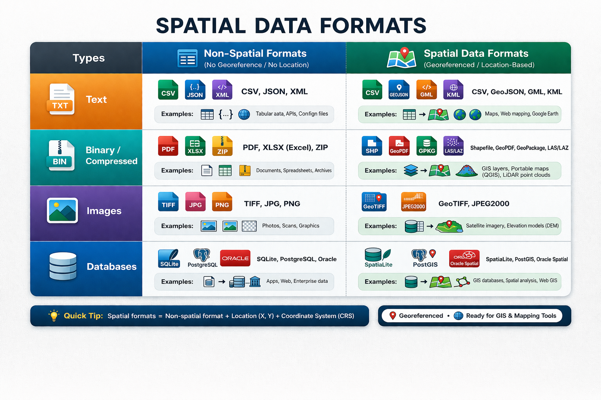

# SPATIAL DATA FORMATS & HOW THEY ARE STORED

- AS we know, *Spatial Data* needs to store the `coordinates` , `geometry`, and `attributes` which means there are specific formats that we need to work with

## Spatial Data Formats

