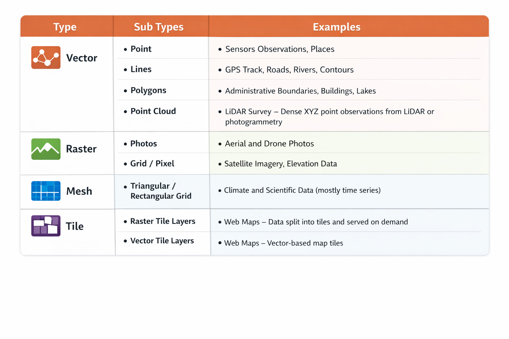

# SPATIAL DATASET / DATA MODEL

## What is Spatial Model ?

The key insight that led to the develpment of Spatial Analysis was the fact that we can combine data and location, and when we put them together, we can use that to derive a lot of useful insights.

 **Spatial Data Model** consist of 2 parts:
- `Geometry (Shape)`: This consist of points, lines, and polygons 
  
- `Properties (Attributes)`: This is defined with data and data type. 

linking `geometry` with `properties` makes us to be able to with them together

## Example of a SPATIAL DATA 

```json
{
    "type": "feature",
    "geometry": {
        "type": "point",
        "cordinates": [77.5946, 12.9716]
    },
    "properties": {
        "id":1,
        "name": "Bengalure",
        "local_name": "Bengalure"
    }

}

```
## TYPES of SPATIAL DATA





Type : Vector | Sub Types : Point  | Examples: Sensors Observations, Places

Type : Vector | Sub Types : lines  | Examples: GPS Track, Roads, Rivers, contours

Type : Vector | Sub Types : polygons  | Examples: Administrative Boundaries, Building, Lakes


Type : Vector | Sub Types : Point Cloud  | Examples: LIDAR survey . The point cloud is a new Vector data type. These are dense Point Observations where we have both X Y and Z positions and are typically resulted from LIDAR Surveys or Photogrammetry Outputs

Type : Raster | Sub Types : Photos  | Examples: Aeriel and Drone Photos

Type : Raster | Sub Types : Grid / Pixel  | Examples: Satallite Imagery, Elevation Data

Type : Mesh | Sub Types : Triangular / Rectangular Grids  | Examples:Climate and Scientific Data. This are mostly Time Series Data

Type : Tile | Sub Types : Raster Tile Layers | Examples:  Web Maps . This is used in web services if we want to share or publish geopatial data, which involves chopping our data into smaller tiles and each Tiles is fetched by the server depending on when the user request for it


T
Type : Tile | Sub Types : Vector Tile Layers | Examples:  Web Maps . This is similar to Raster Tile layers